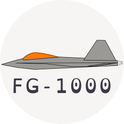
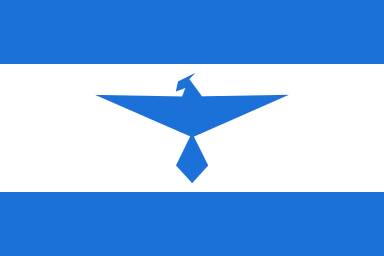
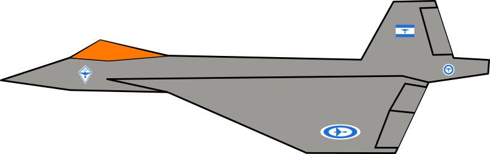

## FG-1000 Phoenix
Welcome to the FG-1000 Phoenix website.

## About The Aircraft

### The Fighter

Read below to learn what to expect from this project and fighter.

#### Characteristics

FG-1000 is a Stealth Super-maneuverable Air Superiority Supersonic Fighter.

##### Stealth

It is designed with Stealth as the primary force. Stealth ruled all other aspects of the fighter, not only for reduced radar cross sections but for reduced infrared signature.

##### Super-maneuverable

FG-1000 has, for it's size, very large wings and very large control surfaces.

+ **Stabilizers**, It's V twin stabilizer are fully mobile, they rotate and control both pitch and yaw.
+ **Ailerons**, The large ailerons not only control roll, but they work with the stabilizer to enhance pitch control.
+ **Wings**, The wings are of a double delta design, with it's root starting before the line of the canopy. This will will provide excellent high AoA flight characteristics and as well low speed maneuverability.

##### Air Superiority

The Phoenix has advanced avionics and radar system, all information from the wingman, RWR, AWACS and ground stations are converged into a large multi-functional displays and a head mounted HUD.

Combined with Stealth and Mid Range Air to Air missiles the FG-1000 will be able to seek and destroy threats before they ever knew they were not alone in the air.

#### Supersonic

With a modern engine, based on the F135 from the F-35 Steal Fighter, it has thrust vectoring and it is super cruise capable. Able to cruise at Mach 1.4 at 40000 feet.

### Naming

#### FG-1000

**FG** stands for [FlightGear](https://www.flightgear.org/), which is the Flight Simulator this model is made for. The **1000** indicates that is the first of its kind, it is the first model jointly made by members of the [FlightGear Republic community](flightgear-republic.org/).

#### Phoenix

Phoenix was chosen by Megaf, it represents the come back. It is also a symbol of FGR (FlightGear Republic) and it on it's flag.

### History

The very first sketches of this aircraft were drawn by Megaf and  were nothing but a fighter shaped placeholder for the roundel and insignia of the FGRAF (FlightGear Republic Air Force).

Megaf first jokingly asked if anyone would make a real FlightGear model of that. Wolf answered the call and so it started.